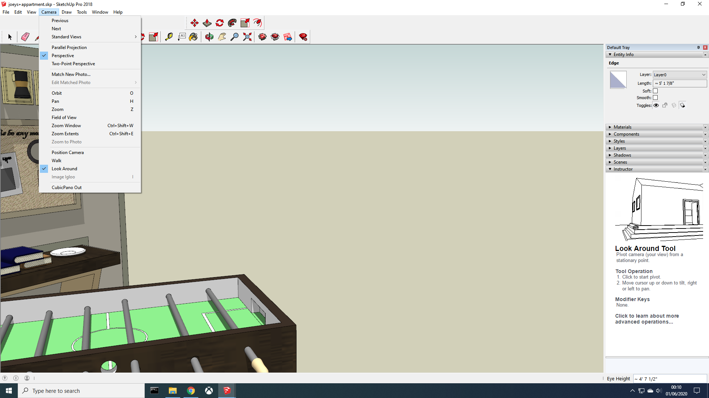
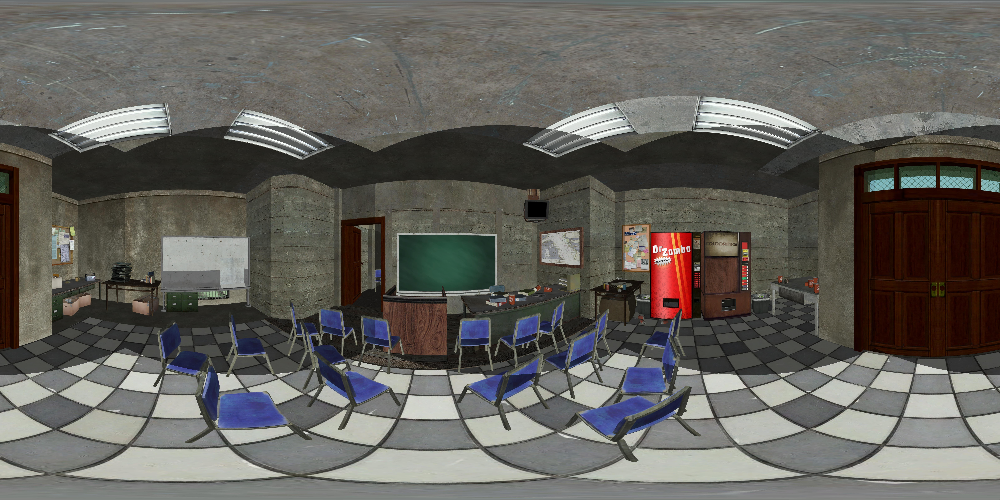
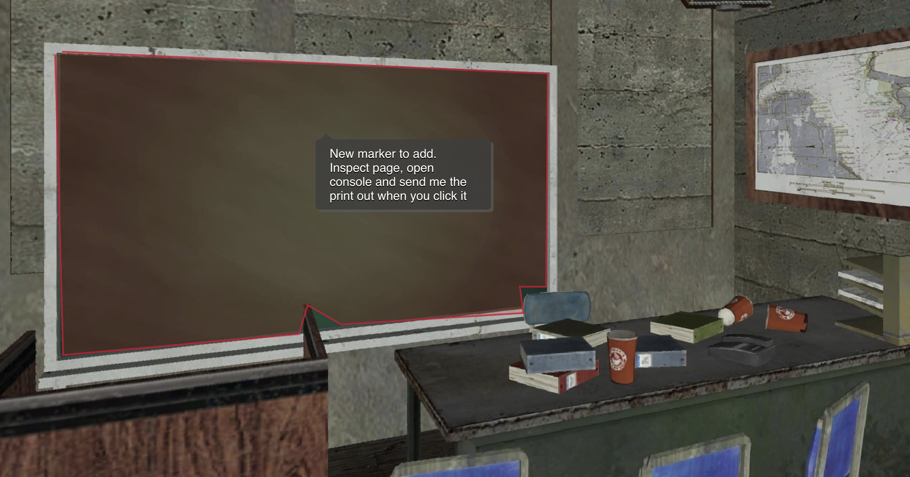
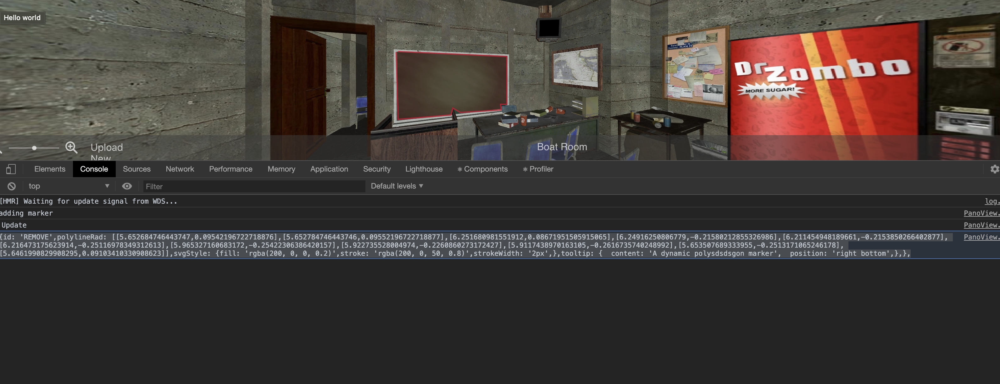

# Escape Room - (http://martinodonnell.github.io/escape-room)

The current application is used to mask out parts of the screen with a transparent polygon so that it can be coded into the backend to be clickable to create puzzles for the escape rooms. To do this, you need to upload a panoramic image. (Use Chrome on a computer)

# Create a Panoramic Image

To create a panoramic image, you can either go to the internet or make one yourself. If you get it from the internet, it needs to be good quality. If you upload the image and it looks blurry, find another.

## Create your own

1. Find your rooms

   To create your own, you will need SketchUp. Any version will work. If you don't want to make your room, go to the [sketup](https://3dwarehouse.sketchup.com/) website. They have loads of pre-built rooms and props that you can build your escape room. These are a couple of people that have created rooms you can use

   - [Koen J.](https://3dwarehouse.sketchup.com/user/0998643389915521058863890/Koen-J?tab=models&fbclid=IwAR2M4KUY2rlFTZDfrOtIUU1DdvUEamtUHtKvALx9MEvYgK72UzuZadxsh5k)
   - If you find more send them to me

   Some of the files can be very large, so review them before you download. You can do this by clicking into a [page](https://3dwarehouse.sketchup.com/model/1448af338658386ca7ddea3837679ff/Joeys-Apartment-From-Friends?fbclid=IwAR2gIp9h-HFeuH73_6xepH1ZJ8kLDzMIBMqhvv5BoHciqfFiEJgz5LvXtm0) and hovering over the image. There will be a button saying 3D Model. If you like it, download it. <b>Make sure to download it in the correct version of sketchup</b>

2. Download SketchUp and install CubicPano Out

   1. Install Sketchup
   2. Download CubicPanoOut
   3. Go to your downloads and compress cubicpanoout.rb to zip then change the cubicpanoout.zip to cubicpanoout.rbz
   4. Open SketchUp
   5. In the top bar click Window -> Extension Manager -> Install Extension
   6. Fine the cubicpanoout.rbz file.
   7. Cubic pano tab should be added in the camera tab

   

3) Make changes to the room.

   Add items to the room to make it follow your theme. The room needs to be fully enclosed, so add a roof.

4) Create the panoramic

   1. Place the camera in the center of the room or where you want the user to stand during the escape room. Use the orbit tool, and look around tool to move about. This is very hard to do so take your time. To get the look around tool, select orbit and then left-click on the screen. It will be an option.
   2. Go to the top bar and click the camera. Select CubicPano Out.
   3. Set Resolution to <b>2000</b>
   4. Set Create Cube Pages to <b>False</b>
   5. Top Image Correction <b>True</b>
   6. Click ok

   This will create 6 images. You need to change there names to follow this format:

   | Old Filename  | New Filename |
   | ------------- | ------------ |
   | Image0000.jpg | f.jpg        |
   | Image0001.jpg | r.jpg        |
   | Image0002.jpg | b.jpg        |
   | Image0003.jpg | l.jpg        |
   | Image0004.jpg | u.jpg        |
   | Image0005.jpg | d.jpg        |

   To create a single image, click [here](https://360toolkit.co/convert-cubemap-to-spherical-equirectangular). Select the 4th option with the six images. Upload your images and wait. This can take a minute. Make sure it looks somewhat right. If they are not in the correct order, you named them wrong.

   

# Mask out part of the image.

1. Upload an image
2. Click on the screen to outline part of the image. Note: You can not add markers if there is red over it
   

3. When done, open the console (Guide for Chrome)

   - Right-click
   - Inspect
   - Console tab

   

The output from the console will look like this. Replace the <b>REMOVE</b> id with a proper name without spaces or special characters. Use '-' for spaces. Keep the double quotes around your new id. You need to copy this into the file you will send me! Reload the page to create a new mask

```
{
    id: "REMOVE",
    polylineRad: [
        [5.64795738101464, 0.09411943394116862],
        [5.64805738101464, 0.09421943394116862],
        [6.2496909030502446, 0.086083099181818],
        [6.252265685532291, -0.21926084067087537],
        [6.21755456008682, -0.22380091003904812],
        [6.213705997277375, -0.24684255715245862],
        [5.948332015638613, -0.2559479065934398],
        [5.916511911844183, -0.22472068855170213],
        [5.915389309530244, -0.2552589692165572],
        [5.651305597479422, -0.2504441925561536],
        [5.6437952328279755, 0.09178100601374162],
    ],
    svgStyle: {
        fill: "rgba(200, 0, 0, 0.2)",
        stroke: "rgba(200, 0, 50, 0.8)",
        strokeWidth: "2px",
    },
    tooltip: {
        content: "A dynamic polysdsdsgon marker",
        position: "right bottom",
    },
},

```

## Setup Code Base

```
git clone https://github.com/martinodonnell/escape-room.git
cd escape-room
npm install
npm start
```

Redeploy Website

```
npm run deploy
push changes
```
